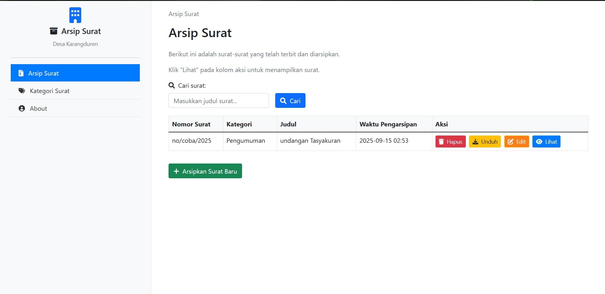
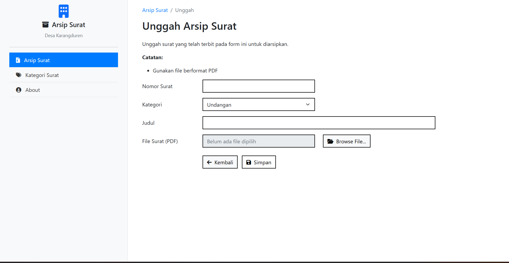
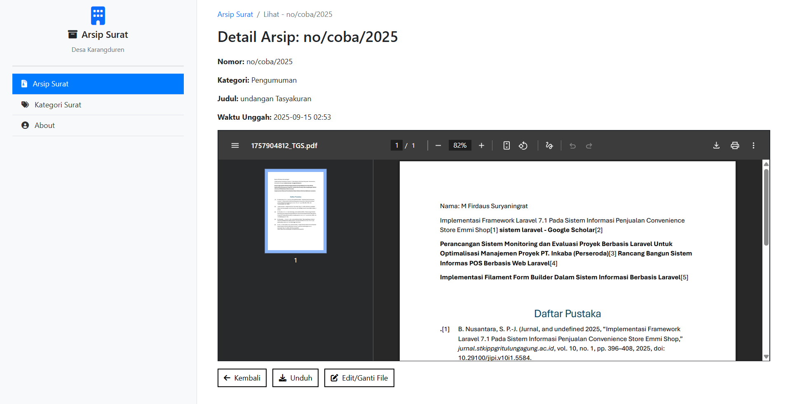
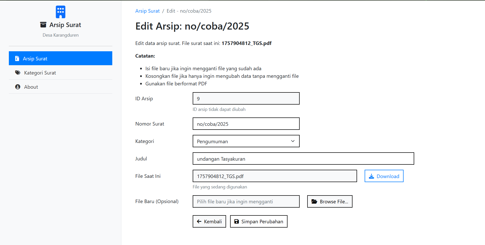
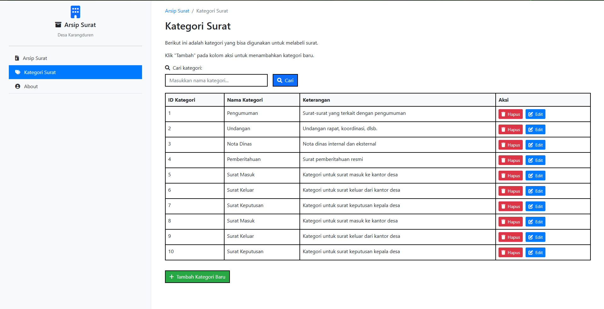
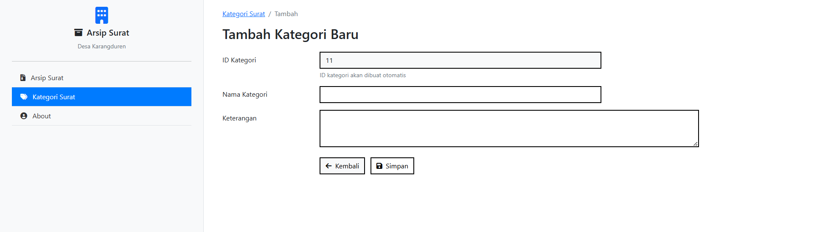
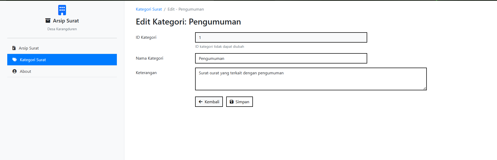
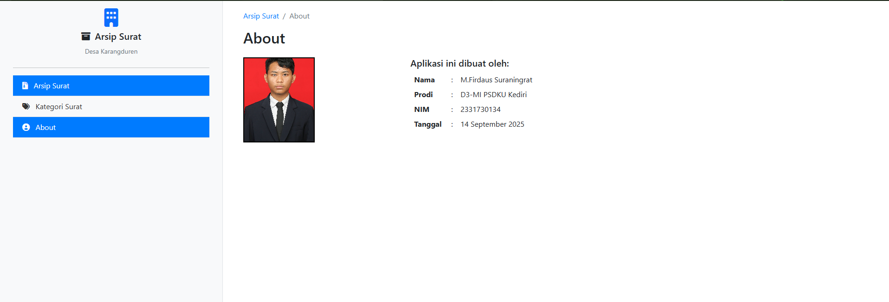

<div align="center">

# 📄 Arsip Surat

**Aplikasi web sederhana untuk mengarsipkan dan mengelola surat resmi di lingkungan desa**


</div>

---

## 🎯 Tujuan

Membantu digitalisasi dokumen surat agar lebih mudah dicari, aman, dan efisien dalam pengelolaan arsip kantor desa.

## ✨ Fitur Utama

- 📤 **Upload & manajemen surat** (PDF, max 10MB)
- 🔍 **Pencarian surat** secara real-time
- 👁️ **Preview & download PDF** langsung di aplikasi  
- 🗂️ **CRUD kategori surat** dengan mudah
- 🔒 **Validasi & keamanan upload** file
- 📱 **Tampilan responsive** (desktop & mobile)

## 🚀 Cara Menjalankan

### 📋 **Langkah Instalasi**

1. **Clone repository**
   ```bash
   git clone https://github.com/shuriza/arsip-surat.git
   cd arsip-surat
   ```

2. **Install dependencies**
   ```bash
   composer install
   ```

3. **Setup environment**
   ```bash
   cp .env.example .env
   php artisan key:generate
   ```

4. **Konfigurasi database**
   > Edit file `.env` dan sesuaikan pengaturan database Anda

5. **Migrasi & seed database**
   ```bash
   php artisan migrate
   php artisan db:seed
   ```

6. **Buat storage link**
   ```bash
   php artisan storage:link
   ```

7. **Jalankan aplikasi**
   ```bash
   php artisan serve
   ```
   > Akses aplikasi di: http://localhost:8000

---

## 🖼️ Preview Aplikasi

### 🏠 Dashboard
*Halaman utama dengan daftar arsip dan fitur pencarian*



### 📤 Upload Surat  
*Form upload dokumen dengan validasi lengkap*



### 👁️ Preview Surat
*Preview PDF dengan opsi download*



### ✏️ Edit Surat
*Halaman edit untuk memperbarui data surat*



### 🗂️ Manajemen Kategori
*CRUD kategori untuk mengorganisir surat*



**Tambah Kategori**


**Edit Kategori**  


### ℹ️ Halaman About
*Informasi aplikasi dan pengembang*



---

<div align="center">

**Dibuat dengan ❤️ menggunakan Laravel**

[](https://github.com/shuriza)

</div>
